# Voxel Blender Plugin

A Blender addon for generating voxel models from 2D images using different fill algorithms (silhouette intesection, spatial carving, gradient-based depth estimation).

---

## Repository Structure

voxel_blender_plugin/ \
├── blender_manifest.toml \
├── carve.py \
├── depth_map.py \
├── experiment1parallelized.py \
├── experiment1.py \
├── experiment2_setup.py \
├── experiments \
│   ├── exp1 \
│   ├── exp2 \
│   └── __init__.py \
├── generate_comparison_grid.py \
├── generate_mesh.py \
├── __init__.py \
├── LICENSE \
├── operators.py \
├── panel.py \
├── presets.py \
├── preview.py \
├── README.md \
├── silhouette_intersect.py \
├── utils.py \
├── voxel_generator-1.0.0.zip \
└── VoxelGrid.py \

---

## Installation (How to Use the Plugin)

Download the code as a ZIP file or clone the repo:
   ```bash
   git clone https://github.com/tkrajtmajer/voxel_blender_plugin.git 
   ```

Install in Blender

    Open Blender

    Go to Edit → Preferences → Add‑ons

    Click Install…, select the downloaded .zip file (or the plugin/ folder if unzipped)

    Enable the add-on by checking the box next to its name

Use the Plugin

    The plugin is accessible in the 3D View → Sidebar (press N) → Voxel Plugin tab


## Getting Started

To get started, load **at least two** desired images, specify the **size** of the grid (width \* height \* depth), and the fill algorithm (under **Method**). You can then experiment with setting different parameters and using different inputs and fill algorithms.

To get started, you can use any of the images that were used to run the experiments, found in 
    ```
    ./experiments/exp1/images_sub/ ```
or 
    ```
    ./experiments/exp2/assets/ ```


For example, the following models use images from ```./experiments/exp2/assets/``` directory, and the default silhuoette spatial carving algorithm and produce this output:

***INPUT IMAGES:***


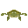

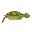
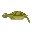
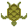
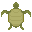

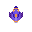

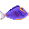
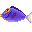
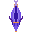
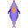

***OUTPUT VOXEL GRIDS:***

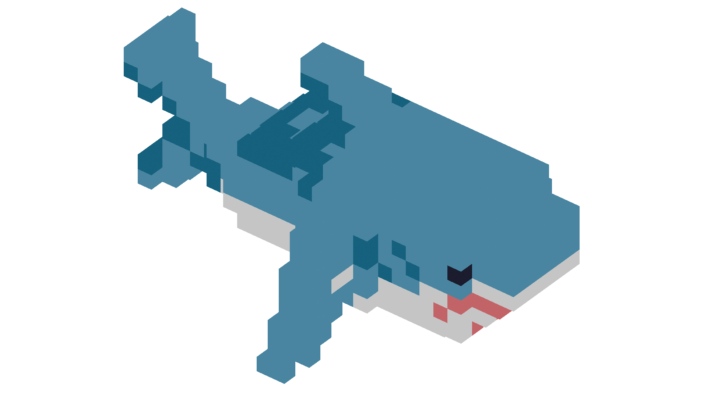
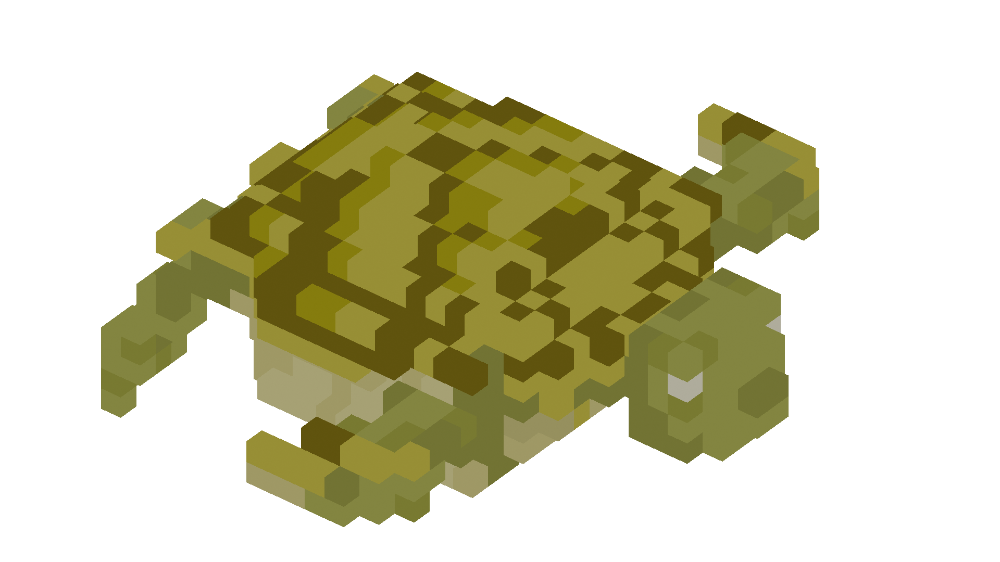
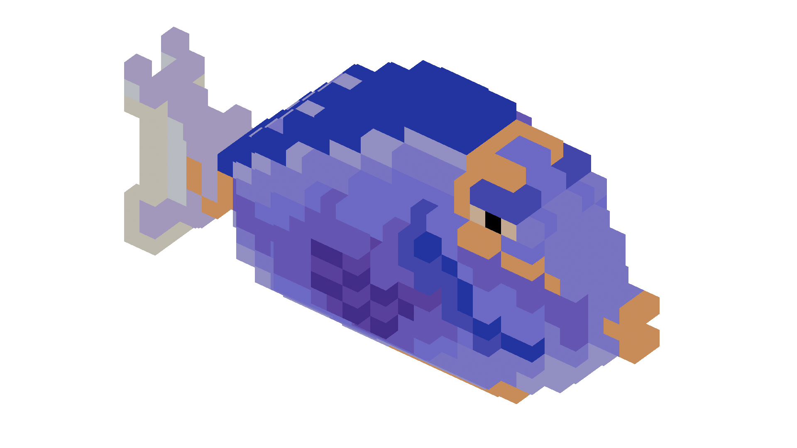

## Running experiments
### Experiment 1

The files for the experiment are in the subdirectory ```./experiments/exp1/```.
The subdirectory includes the ground truth for the chosen models, the images of the reference models rendered from the same 6 viewpoints, and the ```.vox``` models themselves. 

The results are written in the ```./experiments/exp1/results.csv``` file and include all the chosen best parameters for each model.

You can run the first experiment both through the plugin and throught the terminal. To run the experiment from the plugin, simply select the "Run Experiment 1" button in the Plugin menu. To run it through the terminal, use 
```bash
blender --background --python /path/to/voxel_generator/experiment1parallelized.py
```

To run the experiment with our inputs, simply run it as was stated. If you wish to include your own models, first include your own ```.vox``` files in the ```./experiments/exp1/models/``` subdirectory, then run the algorithm 
```bash
export.py
``` 
separately with the terminal. The model colors will be extracted in ```./experiments/exp1/ground_truth/*name_of_your_model*.txt```. You also need to include at least two rendered images of your model, named after the corresponding viewpoints, in ```./experiments/exp1/images_sub/*name_of_your_model*```.

### Experiment 2
The files for the experiment are in the subdirectory ```./experiments/exp2/```.
The subdirectory includes the assets that were used in the epxeriment (2D reference images), the grids that were produced for comparison when using running the algorithm setup (rendered as 2D images from opposite viewpoints), and the results.

The results are written in the ```./experiments/exp2/results/``` subdirectory.

You first need to run the setup for the experiment, then you can run the algorithm that measures IoU and MSE between the expected and outputted images.

To run the setup, select the "Run Setup Experiment 2" button in the Plugin menu. To run it through the terminal, use
 ```bash
 blender --background --python /path/to/voxel_generator/experiment2_setup.py
 ``` 
The rendered grids will be outputted in ```./experiments/exp1/rendered_out/```. Note that before running the experiment, you need to specify the reference camera which will be used to render the created grids. We recommend setting the Camera to Orthographic Rendering. 

To run the comparison algorithm, you first need to install the ```PIL``` library to your Blender environment, which can be done by using the command: \
```bash
<path-to-blender>/blender --background --python-expr "import ensurepip, subprocess, sys; ensurepip.bootstrap(); subprocess.check_call([sys.executable, '-m', 'pip', 'install', 'Pillow'])"
```

Then you can run 
 
```bash
blender --background --python /path/to/voxel_generator/exp2/measure_overlap.py
```

to get the values for each set of (input,output) views separately, or run

```bash
blender --background --python /path/to/voxel_generator/exp2/measure_overlap_avg.py
```

to get the averaged values over two or three views.